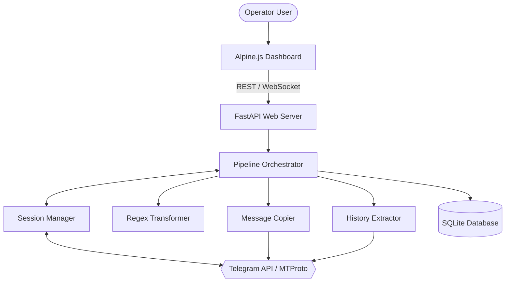

# Architecture

TelegramMirror runs as a localized pipeline with an embedded web server. It does not require Node.js or a traditional two-tier deployment. The FastAPI backend serves the `frontend/` directory statically and exposes a REST/WebSocket API that the Alpine.js client consumes.

At the core of the system is the **Orchestrator**, which manages the lifecycle of a cloning job. It interfaces with the `SessionManager` to retrieve active `Telethon` clients. The system supports multi-account failover: if Account 1 hits a `FloodWaitError` from Telegram, the Orchestrator will transparently attempt to hand the operation off to Account 2.

All message states are persisted locally in SQLite (`data/database.sqlite`). This allows the `CheckpointService` to remember exactly which `message_id` was last processed, enabling perfect resumes.

## Components

- **FastAPI / Uvicorn Server** — Handles incoming HTTP control signals from the UI and pushes real-time `logging` events out via WebSockets. See [`modules/web.md`](modules/web.md).
- **Orchestrator** — The heart of the pipeline. Pulls history, triggers transformers, handles retries, and delegates to the Copier. See [`modules/core.md`](modules/core.md).
- **Session Manager & Failover** — Maintains the raw MTProto connections to Telegram and manages account switching on rate limits.
- **SQLite Repositories** — Handles the `models.py` schema for settings, regex rules, and checkpoint tracking. See [`modules/db.md`](modules/db.md).

## System Diagram

## Data Flow

1. **User Start** — The operator clicks "Start" in the UI. A payload with the source, destination, and mode is sent to `api_orchestrator.py:start_flow()`.
2. **Task Initialization** — The `Orchestrator` determines the last checkpoint via `CheckpointService` and requests a batch of messages from `history_service.py`.
3. **Transformation** — Each message is passed to `transformer.py` where regex rules (links, usernames) are applied.
4. **Execution & Failover** — The `Copier` attempts to send/forward the message. If a `FloodWait` occurs, `Failover` switches the active Telethon client.
5. **Persistence** — Upon success, the `CheckpointService` updates the database. The Orchestrator broadcasts a success log to the WebSocket manager.

## Key Design Decisions

- **Embedded Zero-Build UI**: To ensure the project can be bundled into a single `.exe` via PyInstaller, the frontend uses Alpine and Tailwind CSS via CDN. There is no build step.
- **Dual-Account Strategy**: Telegram imposes strict limits. We require the user to configure two accounts to allow seamless active-passive failover.
- **SQLite**: Local file-based storage ensures the app remains highly portable.