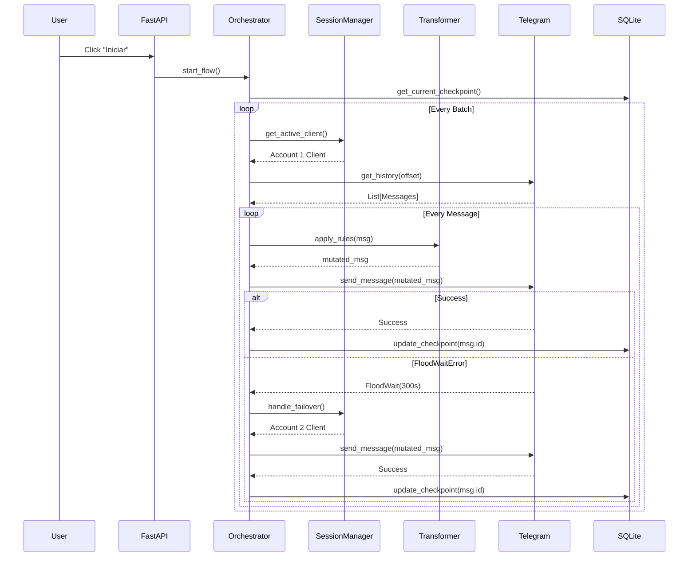

# Sequence Diagrams

## Workflow: Core Orchestration Loop

This diagram illustrates how the Orchestrator pulls messages, transforms them, handles a potential rate-limit failure, and persists the checkpoint.

### Walkthrough

1. **User input** — The operator initiates the pipeline from the dashboard.
2. **Batch Retrieval** — The orchestrator pulls messages from Telegram.
3. **Transformation** — Regex rules are applied locally.
4. **Execution & Failover** — The message is sent. If Telegram throws a `FloodWaitError`, the orchestrator immediately requests the secondary client from the Session Manager and retries.
5. **Persistence** — Once successful, the message ID is saved to SQLite, ensuring that a sudden crash won't cause duplicate sends upon restart.
